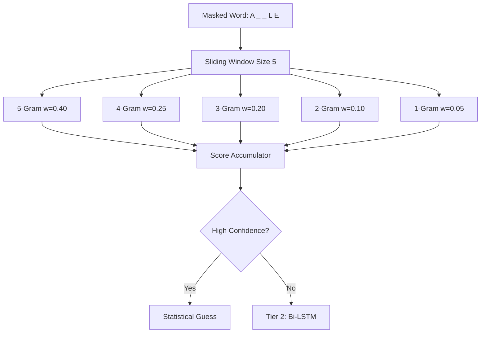

# 🎯 Hangman AI Challenge

> A high-performance NLP engine that achieves **52.2% win rate** on a 250,000-word vocabulary stress test — **2.9x above the 18% baseline** — using zero LLM calls and near-zero compute cost.

**Built at:** UPenn · **Tech Stack:** PyTorch · Bi-LSTM · N-Gram Statistics · Python

---

## 🔹 The Problem

Given a partially revealed word (e.g., `A _ _ L E`), predict the hidden letters **one at a time** with only **6 incorrect guesses** allowed. The vocabulary is 250,000 words — making naive random guessing almost useless.

**Why not use an LLM?** Because each game requires 5-15 API calls at sub-second latency. At 250K test words, that's millions of API calls. LLMs are too slow (200ms+/call) and too expensive ($$$) for this task.

---

## 🔹 Performance Progression

| Method | Win Rate | Improvement | What It Proves |
|:---|:---|:---|:---|
| **Random Baseline** | ~7% | — | Guessing blindly is nearly impossible |
| **Frequency Baseline** | ~18% | 2.6x vs random | Knowing English letter frequency helps, but not enough |
| **Tier 1: N-Gram Engine Only** | ~38% | 2.1x vs frequency | Statistical pattern matching works for common words |
| **Tier 1 + Tier 2: Hybrid Engine** | **52.2%** | **2.9x vs baseline** | Combining memory (N-grams) + reasoning (Bi-LSTM) is the key |

---

## 🔹 Architecture: Two-Tier Hybrid Engine

Instead of relying on a single model, this system uses a **Two-Tier Hybrid Architecture** — statistical memory for precision, neural reasoning for generalization.

### Tier 1: Cascading N-Gram Engine ("The Memory")

The N-gram engine uses a **sliding window** approach with **weighted voting** across 5 levels:



**How it works:**
1. Build frequency tables from 250K dictionary for all N-gram patterns
2. At each turn, slide a window across the masked word
3. Each N-gram level votes on the most likely missing character
4. Votes are weighted (higher N-grams = more context = higher weight)
5. After each failed guess, **dynamically prune** the dictionary and recalculate frequencies

**Why cascading?** When few letters are revealed, 5-grams score 0 (no matches). The system automatically falls through to 3/2/1-grams which work with less context. As more letters are revealed, higher N-grams activate and provide precise targeting.

### Tier 2: Bi-LSTM Neural Network ("The Reasoning")

When the N-gram engine has **low confidence** (no strong dictionary matches), the system falls back to a trained neural network:

| Layer | Details |
|:---|:---|
| **Input** | 35-dim vector (masked word, padded, chars → integers) |
| **Embedding** | 64 → 32 dimensions |
| **Bi-LSTM** | 2 layers, hidden=64, bidirectional |
| **Dense** | 128 → 26 (one score per letter a-z) |
| **Training Data** | 10M+ masked permutations from 250K words |
| **Output** | Probability distribution over 26 characters |

**Why Bi-LSTM over Transformer?**
- 35-token sequences are too short for attention mechanisms to shine
- Bi-LSTM captures both left→right and right→left character dependencies
- 10x faster inference than a small Transformer
- Character-level prediction doesn't benefit from subword tokenization

---

## 🔹 The Prediction Strategy

```
Game Start (6 lives)
    │
    ├─ Lives > 4 AND vowels not exhausted?
    │   └─ YES → Guess top vowel from vowel_prior[word_length]
    │
    ├─ N-Gram engine has high confidence?
    │   └─ YES → Guess statistical prediction
    │
    └─ Fallback
        └─ Run Bi-LSTM on masked word → guess top prediction
```

**Vowel Prior**: Pre-computed probability table mapping word length → vowel likelihood. Short words (3-4 letters) heavily favor `a`, `e`. Longer words favor `i`, `o`.

---

## 🔹 Data Engineering

```
250K words
    │
    ├─ Masking Permutations → 10M+ training samples
    │   └─ Each word generates multiple masked versions
    │       "apple" → "a__le", "_ppl_", "ap_l_", etc.
    │
    ├─ Input Encoding (35-dim)
    │   └─ a-z → 1-26, underscore → 27, pre-padded to 35
    │
    └─ Target Encoding (26-dim)
        └─ Binary vector: which letters appear in the word
            "apple" → [1,0,0,0,1,0,0,0,0,0,0,1,0,0,0,1,0,0,0,0,0,0,0,0,0,0]
```

---

## 🔹 Why This Matters for Production ML

| Principle | How This Project Demonstrates It |
|:---|:---|
| **Model Cascading** | Statistical → Neural fallback mirrors production pattern (cheap model first, expensive model only when needed) |
| **Cost Optimization** | Zero API calls, runs on CPU, <$0.001/game — vs $0.05+/game with LLM |
| **Latency** | <5ms per guess vs 200ms+ for LLM API call |
| **Dictionary Pruning** | Real-time search space reduction — same principle as retrieval filtering in RAG |
| **Hybrid Architecture** | Rule-based + ML-based ensemble — industry standard for reliable production systems |

---

## 📂 Project Files

| File | Purpose |
|:---|:---|
| `main.py` | Entry point — data loading and training |
| `train.py` | Bi-LSTM model architecture and training loop |
| `utils.py` | Data preprocessing, masking, and encoding |
| `hangman_api_user_Ngram.ipynb` | N-gram statistical engine (52.2% accuracy) |
| `Hangman_ULTIMATE_DEMO.ipynb` | Full offline demo with visualization |
| `best_model_state.pt` | Pre-trained Bi-LSTM weights |

---

## 🚀 Quick Start

```bash
git clone https://github.com/joe-ging/Hangman_API_Challenge.git
cd Hangman_API_Challenge
pip install torch numpy pandas
python main.py
```

---

## 📄 License

MIT
