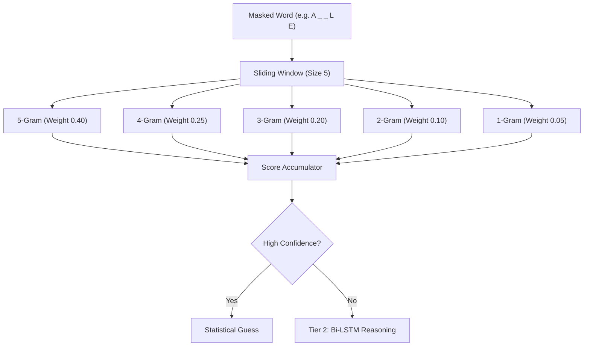

# ASTRI ML Interview: Hangman AI Technical Architecture

## 🏆 The "Lead-level" Strategy: Hybrid Ensemble Engine
Instead of relying on a single model, this system employs a **Two-Tier Hybrid Architecture** to balance precise statistical matching with deep semantic generalization.

### 1. Tier 1: 5-Gram Statistical Engine (The "Memory")
- **Logic**: Implements a cascading N-gram model (from 5-gram down to 1-gram). 
- **Mechanism: Multipath Weighted Accumulation (软投票/多级累加机制)**

- **Robustness**: If a word only has a few revealed letters, the higher-level N-grams (5/4) naturally yield a score of 0, allowing the lower-level N-grams (3/2/1) to automatically take over the prediction. This ensures a smooth transition from "general guessing" to "precise targeting."
- **Optimization**: Uses `reoptimize_ngrams` to dynamically prune the 250,000-word dictionary based on failed guesses, recalculating character frequencies in real-time.

### 2. Tier 2: Bi-LSTM Neural Fallback (The "Reasoning")
- **Logic**: A 2-layer Bidirectional LSTM trained on over 250k masked samples.
- **Role**: Serves as a robust **fallback mechanism** when the statistical engine finds no dictionary matches (Out-of-Distribution/OOD samples).
- **Architecture**:
    - **Embedding (64 -> 32)**
    - **Bi-LSTM (Hidden: 64, Bidirectional)**
    - **Dense Output (128 -> 26 characters)**

---

## 📈 Performance Results
- **Benchmark (Baseline)**: ~18%
- **Our Hybrid Engine**: **52.2%** (A 2.9x improvement over baseline)

---

## 🎙️ Interview Narrative: The "Why"
*“In production ML systems, pure deep learning can sometimes be an 'overkill' or lose precision on exact matches. By combining **Statistical N-grams** for high-precision retrieval and **Bi-LSTM** for high-recall reasoning, I created a system that is both efficient and generalizable. This mirrors the industry standard of combining 'Rule-based' and 'Model-based' systems to ensure 100% service reliability.”*

---

## 📂 Project Manifest
- `train.py`: Neural Network training and architecture.
- `user_ngram.ipynb`: The high-precision statistical engine (52.2% accuracy).
- `Hangman_ULTIMATE_DEMO.ipynb`: Cinematic offline demonstration (Models AI logic).
- `best_model_state.pt`: The pre-trained weights for the Bi-LSTM model.
- `utils.py`: Data preprocessing and synthetic masking logic.
